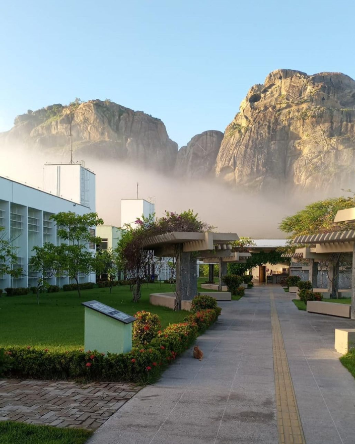
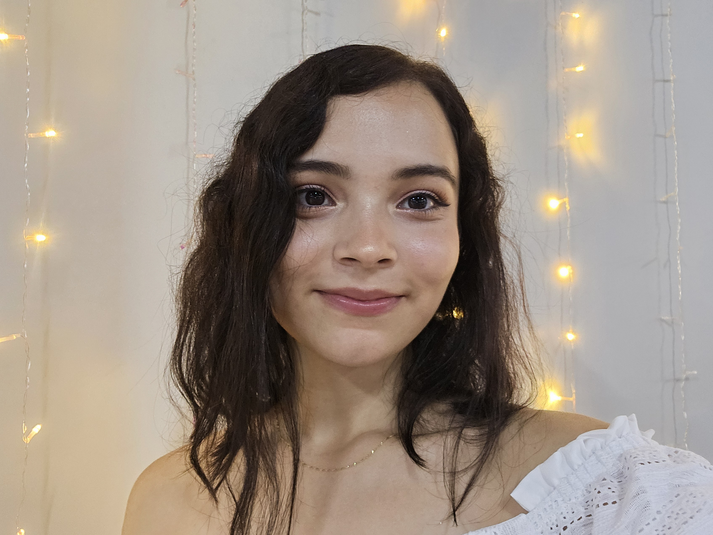

# ⭐ Sobre Mim ⭐

## Quem Sou Eu 💻
Meu nome é __Larissa da Silva Matos__ e sou estudante e bolsista PIBIC na Universidade Federal do Ceará - Campus Quixadá. Vejam como meu campus é lindo:

## O Que Eu Faço 🤍
Eu sou amante de música, jogos e o que chamamos de "rolês saudáveis": nada melhor do que escolher um filme dos anos 70, alguns amigos e um cardápio suculento para ter uma noite incrível!

Atualmente sou estudante de graduação, estou no 9º semestre do curso de Engenharia de Computação e - se Deus quiser - eu termino esse ano! Programo em umas linguagens mais baixo nível (python 🐍 me asssusta!) e lido com circuitos digitais, sistemas embarcados e muuuita matemática.

Além de tudo isso, claro, eu faço um curso de DevOps voltado para mulheres na [Ada Tech](https://ada.tech/) em parceria com a [B3](https://www.b3.com.br/pt_br/para-voce).

## Meus Hobbies 🎧
- Ouvir minha querida Taylor Swift
- Ir à academia
- Jogar Stardew Valley
- Sair com meus amigos

## Contato ☎️
- Email: larissamatos07.lm@gmail.com
- LinkedIn: https://www.linkedin.com/in/lari-matos/

---

[Link do repositório com a última atividade](https://github.com/Lrs-mtos/Larissa-classe1127)

